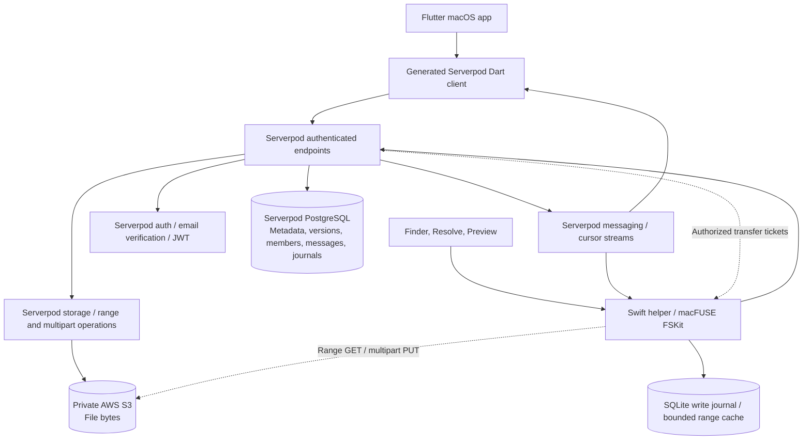
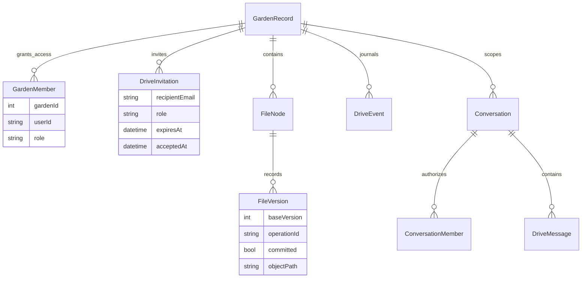
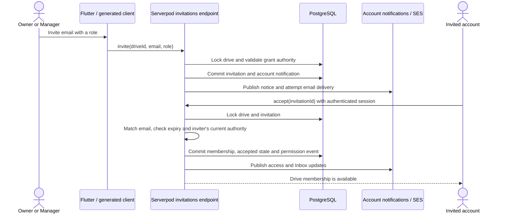
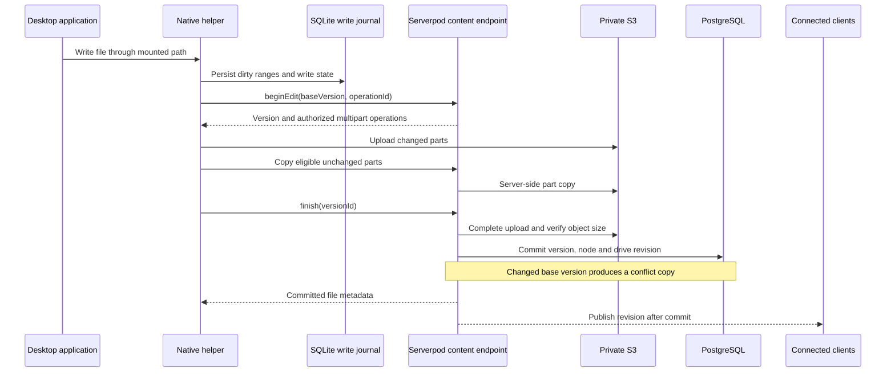

# Garden

[](backend/pubspec.yaml)
[](frontend/)
[](pubspec.yaml)
[](backend/scloud.yaml)
[](backend/lib/src/files/file_storage.dart)
[](https://github.com/victorbash400/garden/releases/tag/v0.1.0-preview.2)

Garden is a remote filesystem for working directly with cloud storage. It mounts as a drive on your Mac, so you can open, edit and save files from the applications you already use.

Downloading remote files before using them consumes local disk space and makes access depend on transfer completion. Garden streams the byte ranges an application requests and keeps a bounded local cache. Files remain in cloud storage; saving to the mounted drive publishes your changes back to it.

You can access your drives from another Mac by signing in, or share a drive with your team. Members access the same files through their own accounts, with permissions controlling who can read, edit and manage the drive. Conversations and file references are available alongside the shared files.


## Using Garden

Garden's Flutter app provides drive management, a file browser, uploads, downloads, storage controls and an Inbox. Its native Swift helper mounts the same drives through macFUSE's FSKit backend. Finder, DaVinci Resolve, Preview and other desktop applications access ordinary filesystem paths while Garden retrieves and publishes cloud data underneath.

The mounted Resolve workflow has been tested through importing MP4 media, cutting and reordering linked video/audio, rendering directly to Garden, saving a `.drp` archive and reopening after remount without relinking. Exported bytes were compared with independent cloud downloads and the corrected video/audio render was decoded and compared with a local control. This is a tested workflow, not a guarantee of uninterrupted playback for every codec or project.


A shared drive keeps the working files in one location while teammates use their own applications. Access is granted through an email-bound invitation that becomes a persisted Serverpod membership after acceptance. File-linked conversations keep discussion attached to the work. The invitation and update flows below show how Garden coordinates that access.

## Architecture



The macOS application is built with Flutter and a Swift filesystem helper. The backend runs on Serverpod Cloud, with PostgreSQL for application data and private AWS S3 for file content.

Serverpod manages **accounts, metadata, permissions, versions and messages**. PostgreSQL persists its generated models; S3 stores the file bytes. Both Flutter and the filesystem helper use the same authorization and file lifecycle, so an operation performed in Finder is visible to the application and other authorized clients.

### Typed models, database integrity and generated clients

Serverpod's `.spy.yaml` definitions generate database access, serialization and the [Dart client](client/lib/src/protocol/client.dart). [FileNode](backend/lib/src/files/file_node.spy.yaml) records directory membership, size, current version and attributes. Its unique sibling-name index prevents duplicate active names within a directory. [FileVersion](backend/lib/src/files/file_version.spy.yaml) records the author, base version, upload state and operation ID. [GardenMember](backend/lib/src/gardens/garden_member.spy.yaml) has a unique drive/user membership index.

The logical data model separates a drive's namespace, file history and access records:



Endpoints use `session.db.transaction` and drive locks to coordinate file changes with revision records. Flutter calls the generated methods through [ServerpodFilesGateway](frontend/lib/services/files/serverpod_files_gateway.dart). Changing a model updates the backend, client and protocol together rather than maintaining separate handwritten Dart schemas.

### Authentication and server-enforced permissions

[Server initialization](backend/lib/server.dart) installs Serverpod's email identity provider and JWT token manager. [Registration email delivery](backend/lib/src/auth/garden_email_config.dart) uses Serverpod Cloud; delivery failures become explicit application errors. [Garden's authentication handler](backend/lib/src/auth/garden_authentication.dart) also rejects missing or blocked identities.

Authenticated endpoints enforce [drive access](backend/lib/src/files/drive_access.dart) and [role capabilities](backend/lib/src/gardens/drive_permissions.dart). Viewer access cannot write; member management and drive ownership have separate capabilities. These checks run on the backend for native filesystem requests as well as Flutter actions. Account deletion removes owned cloud data before releasing the identity, with [resumable cleanup](backend/lib/src/accounts/account_endpoint.dart) if deletion fails.

### Inviting a teammate is an access transaction

An editor should be able to work on a drive without gaining the ability to remove its owner or administer the team. Garden separates `read`, `write`, `manageMembers` and `manageDrive` capabilities. Owners manage the drive; Managers can administer Editor and Viewer memberships; Viewers can read but cannot write. [Role checks](backend/lib/src/gardens/drive_permissions.dart) are reused by the invitation, membership and file endpoints.

The [invitation endpoint](backend/lib/src/sharing/drive_invitations_endpoint.dart) locks the drive and checks both the inviter's membership-management capability and whether they can grant the proposed role. It rejects existing members and duplicate pending invitations. A transaction stores the normalized recipient email, requested role, seven-day expiry and account notification. After commit, the notification is published and [SES email delivery](backend/lib/src/sharing/invitation_mailer.dart) is attempted. Delivery status and errors are stored separately, so an email failure is visible and can be retried without inventing another membership.



[Acceptance](backend/lib/src/sharing/invitation_acceptance.dart) binds the invite to the signed-in account's email. It rechecks expiry, revoked/declined state and the sender's current authority, so an old invitation cannot outlive a sender's permission to grant access. Membership insertion and acceptance are atomic; accepting an already accepted invite for the same user is idempotent. Decline and revoke preserve a recorded outcome rather than deleting the invitation history.

[Membership changes](backend/lib/src/sharing/drive_members_endpoint.dart) produce a [permission revision and recipient notices](backend/lib/src/sharing/member_change.dart). File endpoints consult current membership, and live file streams recheck it on notifications. Flutter and the helper can reconcile access changes through the same event system. Signed transfer tickets already issued to a client are a separate lifetime boundary; removing membership is not a claim that every previously issued URL becomes instantly invalid.

### Live updates with durable catch-up

The [drive journal](backend/lib/src/files/drive_journal.dart) increments a drive revision and inserts a `DriveEvent` inside the same transaction as the mutation. After commit, Serverpod messaging wakes subscribers. `watch` subscribes before replaying persisted events, closing the gap between catch-up and live delivery. Clients resume from their last revision; notifications trigger database catch-up instead of periodic polling. Membership is rechecked before live file events are delivered.

The [Inbox endpoint](backend/lib/src/inbox/inbox_endpoint.dart) similarly exposes a recipient-scoped snapshot and cursor stream. [Conversation endpoints](backend/lib/src/conversations/conversations_endpoint.dart) enforce conversation access, and unread state is recorded transactionally. In Flutter, [InboxController](frontend/lib/state/inbox_controller.dart) loads a snapshot, subscribes from its cursor and refreshes on incoming events, while cancelling the previous subscription when state changes. [ServerpodGateway](frontend/lib/services/serverpod_gateway.dart) wires the generated client to `FlutterAuthSessionManager` and `FlutterConnectivityMonitor`; the widgets consume controller state rather than implementing their own authentication or database access.

### Native filesystem operations and safe cloud writes

A desktop application's rename or create request passes through the [filesystem endpoint](backend/lib/src/files/filesystem_endpoint.dart). Each mutation carries an operation ID. Serverpod stores the request and its result in a transaction; a retry returns the existing receipt, while reuse of the ID with different arguments fails. This makes reconnecting after an uncertain response safer than blindly repeating a mutation.

The native [SQLite write journal](frontend/macos/RemoteDrive/Engine/RemoteWriteJournal.swift) preserves accepted edits before publication. The [write publisher](frontend/macos/RemoteDrive/Engine/RemoteWritePublisher.swift) seals a write, starts an idempotent edit upload and assembles its cloud version. Unchanged eligible multipart regions can be copied inside S3; changed parts are uploaded, and already uploaded parts are checked before resuming.

[Content commit](backend/lib/src/files/content_endpoint.dart) validates upload completeness and object size before updating the current file version. If the base version changed, Garden creates a conflict copy rather than silently overwriting another edit. Active leases can retain an upload until the other writer releases the file.



The separation matters when an editor rewrites only part of a large file, an upload is interrupted, or a teammate publishes a new version first. Local durability, resumable object transfer and the Serverpod commit are distinct stages. Garden preserves the edit and publishes a complete version rather than treating a successful network request as proof that the entire file is safe.

### Reading large files without syncing the entire drive

The [native range cache](frontend/macos/FinderShared/GardenRangeCache.swift) tracks file versions, shares in-flight requests and adapts read windows to access patterns. It stores fetched ranges under a bounded disk budget. Backend [metadata range reads](backend/lib/src/files/bounded_range_reads.dart) accept at most 16 ranges of 64 KiB each, with four concurrent fetch workers, rather than letting media probes request unbounded work.

This reduces unnecessary transfers, but applications that scan every byte can still cause a full-file read. Cold access remains sensitive to network latency. Cache size is a local disk limit, not a purchased cloud storage tier.

## Install the preview

1. Download the [macOS DMG](https://github.com/victorbash400/garden/releases/tag/v0.1.0-preview.2) and move Garden to Applications.
2. If macOS blocks the preview, follow [manual approval instructions](release/INSTALL.txt). It is not notarized.
3. Create an account and enter the verification code delivered to your email.
4. Follow the setup checklist. Finder drives require **macOS 15.4+** and [macFUSE](https://macfuse.io/), with its File System Extension and Garden background activity approved. Garden shows macFUSE installation and Finder connection status.
5. Create a drive, import a file and open it from Finder. Save back to the mounted drive.

The download connects to the hosted backend. Flutter, Xcode and a local server are not needed to use it. See [release validation](release/RELEASE.md) for the installed signup, mounted-save and logout checks. First-time extension approval on a second clean Mac remains unverified.

## Run from source

The repository is a Dart workspace:

```text
frontend/   Flutter UI, state, generated-client gateways, Swift/C filesystem
backend/    Serverpod endpoints, models, migrations, integration tests
client/     Generated Serverpod Dart client and protocol
release/    macOS packaging and installation instructions
```

Install Flutter with **Dart 3.13.4 or compatible**, Xcode and its command-line tools, and **Serverpod CLI 4.0.3**. Building the native helper also requires macFUSE's userspace SDK; [the build script](frontend/macos/RemoteDrive/build.sh) checks for `fuse3/fuse.h`. It uses `/usr/local` by default or `GARDEN_FUSE_SDK` for another SDK prefix.

To run Flutter against the hosted backend:

```sh
flutter pub get
cd frontend
flutter run -d macos
```

### Local Serverpod backend

Create ignored `backend/config/passwords.yaml` with a `development` section containing `database`, `serviceSecret`, `emailSecretHashPepper`, `jwtHmacSha512PrivateKey` and `jwtRefreshTokenHashPepper`. Generate independent random values, for example with `openssl rand -base64 64`. Keep credentials outside Git. A `test` section needs the corresponding database and authentication secrets for backend tests.

Use this shape, replacing every placeholder before starting:

```yaml
development:
  database: '<local-database-password>'
  serviceSecret: '<independent-random-secret>'
  emailSecretHashPepper: '<independent-random-secret>'
  jwtHmacSha512PrivateKey: '<independent-random-secret>'
  jwtRefreshTokenHashPepper: '<independent-random-secret>'
```

[Development configuration](backend/config/development.yaml) uses PostgreSQL on port 8090 and an embedded database data path. Local file content uses Serverpod `DatabaseCloudStorage`, so AWS credentials are unnecessary for this mode. Development verification delivery uses Serverpod's development email behavior.

From the repository root, start the backend explicitly:

```sh
flutter pub get
cd backend
serverpod generate
dart run bin/main.dart --apply-migrations
```

In another terminal:

```sh
cd frontend
flutter run -d macos --dart-define=SERVER_URL=http://localhost:8080/
```

For external PostgreSQL, [Docker Compose](backend/docker-compose.yaml) provides development/test services on ports 8090/9090. Set `GARDEN_DB_PASSWORD` and `GARDEN_TEST_DB_PASSWORD` to match `passwords.yaml`, remove `database.dataPath` from the respective configuration, then start the required Compose service. Use either embedded or external PostgreSQL for a given port.

### Production configuration

[Serverpod Cloud configuration](backend/scloud.yaml) identifies the `garden` project. Production requires `GARDEN_S3_BUCKET` and `GARDEN_S3_REGION`, AWS credentials in Serverpod secrets, and `scloudAuthEmailKey` for verification emails. Invitation email additionally uses SES with `GARDEN_EMAIL_FROM` and `GARDEN_EMAIL_REGION` (or the S3 region). [Expired-upload cleanup](backend/lib/src/files/upload_cleanup_tasks.dart) additionally requires the cleanup Lambda/role ARNs and `uploadCleanupToken`; locally it uses Serverpod future calls. Provision these resources and secrets before deploying with `scloud deploy`.

## Verification

```sh
# From frontend/
flutter test
dart analyze lib
flutter build macos --release --no-pub

# From backend/, with test database/secrets configured
dart test
```

Tests cover [email-bound invitation acceptance](backend/test/integration/drive_invitations_test.dart), [membership changes](backend/test/integration/drive_members_test.dart), [sharing events](backend/test/integration/sharing_events_test.dart), [filesystem mutations](backend/test/integration/filesystem_test.dart), [permissions](backend/test/integration/drive_permissions_test.dart), [account deletion](backend/test/integration/account_deletion_test.dart), [bounded reads](backend/test/unit/bounded_range_reads_test.dart) and [multipart copying](backend/test/unit/multipart_copy_test.dart). Native [write publisher](frontend/macos/RemoteDriveTests/WritePublisherTests.swift) and [range cache](frontend/macos/RemoteDriveTests/RangeCacheTests.swift) tests exercise the mounted engine independently of Flutter.

Live release checks include email verification, drive creation, native mounting, MP4/WAV/PNG/Markdown saves matched against cloud reads, and mount removal on logout. These complement the automated tests; UI test fixtures alone do not establish a working cloud roundtrip.

## Platform and storage support

The current application supports macOS and the hosted AWS S3 backend. Additional device platforms and user-connected storage providers are planned.
