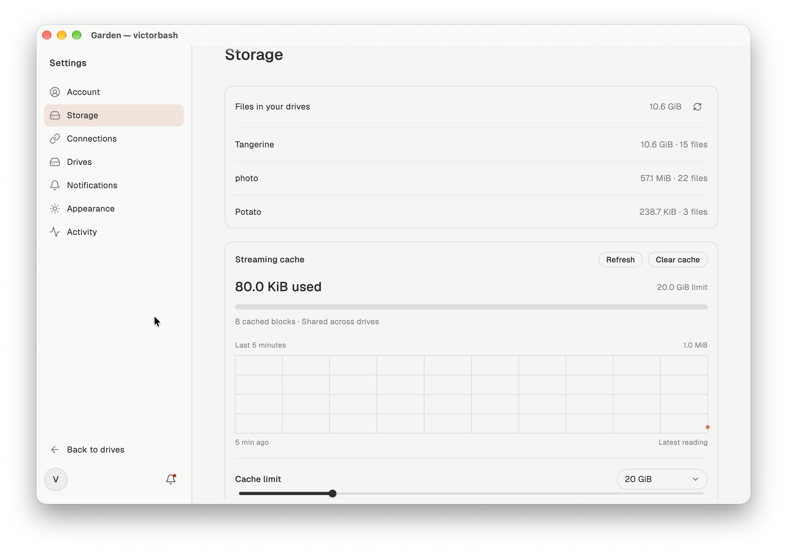
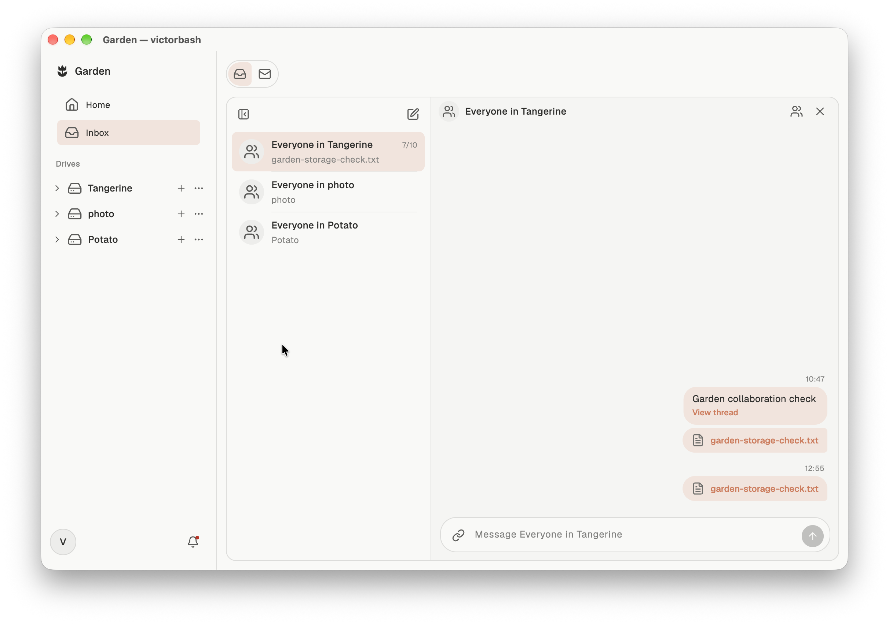

# Garden

Cloud storage becomes expensive when the same work has to live in several places. A video project moves between an editor, local disks, a cloud subscription and a shared team folder. Each move adds another copy, another download and another question about which file is current. Object storage from services such as AWS and Google Cloud offers another way to store the bytes, but a bucket alone is not a drive that your applications can use.

Garden brings cloud files into the applications where work happens. Create a personal or shared drive, open it in Finder, edit with your usual tools and save directly back to the drive. The aim is one working location across your devices and collaborators, with local storage used for the data you need rather than a full copy of every project.

Garden is built with **Flutter and Serverpod**, starting on **macOS**. The current hosted backend runs on Serverpod Cloud and stores file content in private AWS S3 storage. Additional device platforms and user-connected storage providers are planned.


## Work from the drive

Garden provides a file browser with list, grid and column views, uploads, downloads and file opening. Its native macOS helper mounts the same drive in Finder through macFUSE, so other applications can read and write it through ordinary filesystem operations.

This makes the drive useful beyond Garden's own interface. Media, images, documents and project files stay in their folder structure while you work in an editor. Reads fetch byte ranges on demand and reuse a bounded local cache. Writes are journaled locally, then published as cloud file versions. An application that scans an entire file can still cause a full read; streaming does not make every application access pattern cheap.


Storage settings show cloud file usage per drive alongside the separate streaming cache, with controls for its limit and cleanup.



## Share the work

Invite collaborators with Owner, Manager, Editor or Viewer permissions. Garden checks these permissions on the server for file access and changes, rather than relying on hidden UI controls. The Inbox brings drive conversations, private conversations, invitations, unread state and file references into the same workspace. File changes and messages arrive through Serverpod streams.



## How Serverpod runs Garden

Serverpod owns authentication, persistent metadata, messages, permissions, file versions and live updates. Its database layer stores this application data in PostgreSQL; AWS S3 stores the file bytes. Flutter uses its generated Dart client; the native filesystem helper talks to the same authenticated endpoints.

```text
Flutter app                 Finder / desktop applications
     │                                  │
Generated Dart client            Swift + macFUSE helper
     │                                  │
     └────────── Serverpod API ──────────┘
                       │
           ┌───────────┴───────────┐
           ▼                       ▼
   Serverpod PostgreSQL        Private AWS S3
  metadata, membership,        file content and
  versions, messages           multipart uploads
```

| Responsibility | Implementation |
| --- | --- |
| Accounts and verified email signup | [Auth service setup](backend/lib/server.dart), [Serverpod Cloud email delivery](backend/lib/src/auth/garden_email_config.dart), and [Flutter authentication gateway](frontend/lib/services/serverpod_gateway.dart) |
| Typed data and API calls | [Serverpod model definitions](backend/lib/src/files/file_node.spy.yaml), [generated client](client/lib/src/protocol/client.dart), and [Flutter file gateway](frontend/lib/services/files/serverpod_files_gateway.dart) |
| Shared drives and authorization | [Drive endpoints](backend/lib/src/gardens/garden_endpoint.dart), [roles](backend/lib/src/gardens/drive_permissions.dart), and [access checks](backend/lib/src/files/drive_access.dart) |
| Uploads, versions and cloud storage | [Content endpoint](backend/lib/src/files/content_endpoint.dart), [multipart object storage](backend/lib/src/files/multipart_object_store.dart), and [Serverpod S3 configuration](backend/lib/src/files/file_storage.dart) |
| Live file and Inbox updates | [Drive journal](backend/lib/src/files/drive_journal.dart) and [Inbox stream](backend/lib/src/inbox/inbox_endpoint.dart), with persistent cursors for reconnecting |
| Durable filesystem operations | [Filesystem endpoint](backend/lib/src/files/filesystem_endpoint.dart), [native write journal](frontend/macos/RemoteDrive/Engine/RemoteWriteJournal.swift), and [native API client](frontend/macos/FinderShared/GardenAPI.swift) |
| Flutter application and native integration | [App composition](frontend/lib/main.dart), [Finder bridge](frontend/macos/Runner/GardenFinderBridge.swift), and [range cache](frontend/macos/FinderShared/GardenRangeCache.swift) |

PostgreSQL transactions coordinate metadata changes, version commits and journal entries. File bytes use Serverpod's cloud storage integration, with range and multipart operations for large files. Expired uploads are cleaned up through [Serverpod future calls locally and AWS scheduling in production](backend/lib/src/files/upload_cleanup_tasks.dart).

## Try Garden

Download the [macOS preview](https://github.com/victorbash400/garden/releases/tag/v0.1.0-preview.2), move Garden to Applications and create an account with your email. The setup checklist guides you through creating a drive and connecting Finder.

Finder mounting requires **macOS 15.4 or later** and [macFUSE](https://macfuse.io/). Garden checks installation status and links to the required settings. The preview requires manual macOS approval because it is not notarized. See [installation instructions](release/INSTALL.txt) and [release validation](release/RELEASE.md).

The installed release has been checked through ordinary email verification, drive creation, mounting, saving MP4, WAV, PNG and Markdown files, independent cloud byte comparisons, and logout unmounting. Backend coverage includes [filesystem operations](backend/test/integration/filesystem_test.dart), [drive permissions](backend/test/integration/drive_permissions_test.dart) and [account deletion](backend/test/integration/account_deletion_test.dart). Native media editing and export have also been exercised with DaVinci Resolve; universal codec support and uninterrupted playback are not guaranteed.

For development, the repository is a Dart workspace: `frontend/` contains Flutter and the native helper, `backend/` contains Serverpod, and `client/` contains its generated client. With Flutter, Dart and Xcode installed:

```sh
flutter pub get
cd frontend
flutter run -d macos
```

This connects to the hosted backend by default. To use your own configured Serverpod instance, pass `--dart-define=SERVER_URL=http://localhost:8080/`. Backend credentials belong in untracked configuration files, never in the client or repository.
