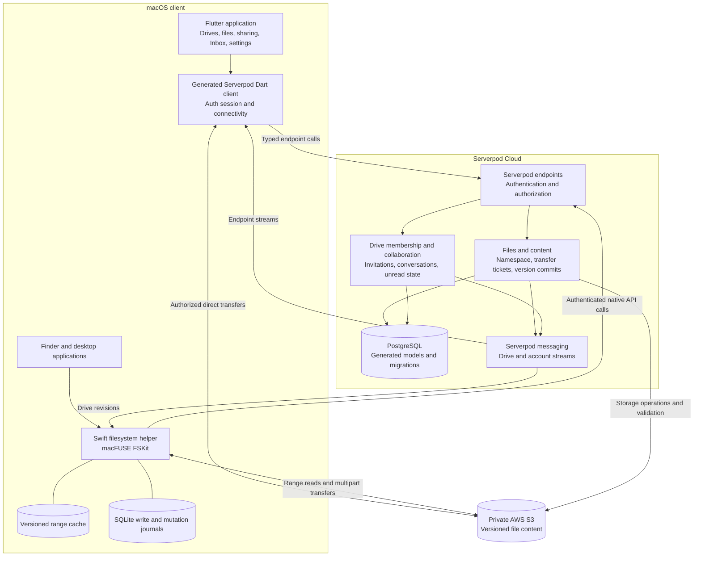
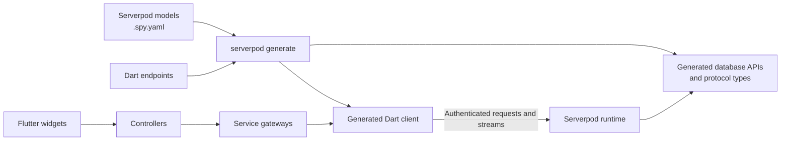
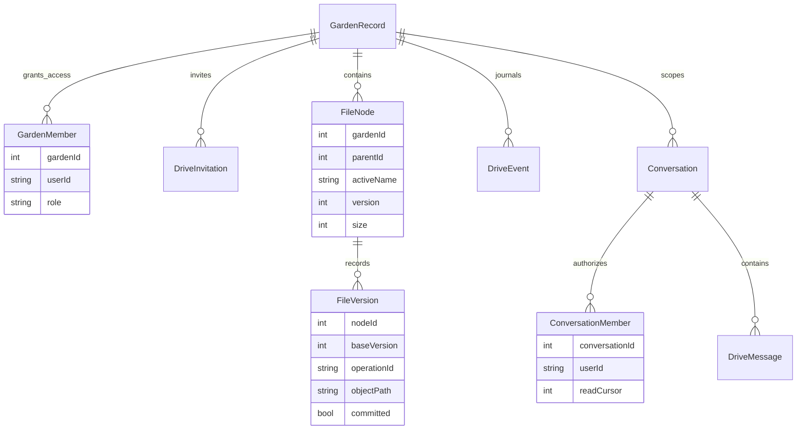
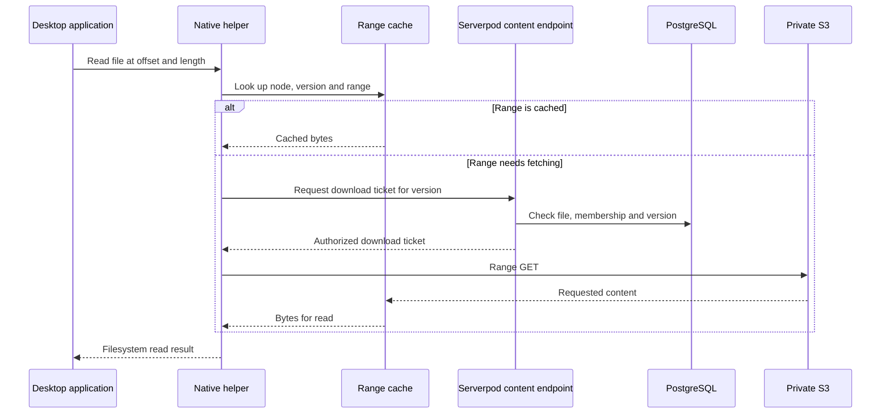
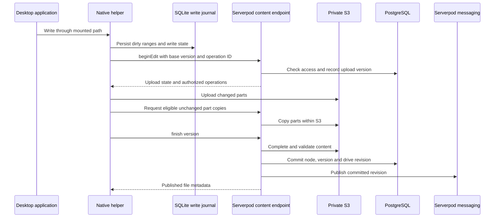
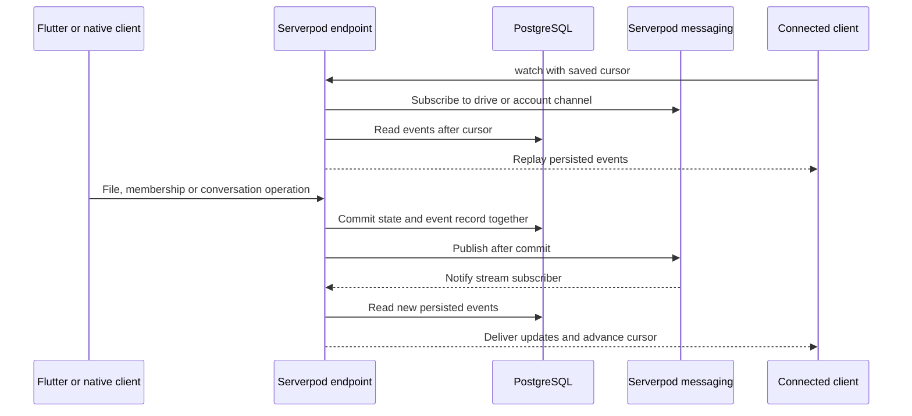

# Garden architecture

Garden is a remote filesystem with a Flutter macOS application and a Serverpod backend. The application and mounted drive operate on the same accounts, permissions, namespace and file versions. Serverpod Cloud hosts the backend; PostgreSQL persists application data, and private AWS S3 stores file content.

## System overview

**Serverpod coordinates the drive.** A file's name, directory, version and access rules live in PostgreSQL. Its bytes live in S3. Clients obtain authorized transfer operations through Serverpod; direct object transfers do not grant authority to change metadata or publish a version.

The Flutter browser and native mount use the same backend operations. Changes made through Finder are reflected in Garden and delivered to other authorized clients through revision streams.

## Serverpod and Flutter

| Serverpod feature | How Garden uses it |
| --- | --- |
| Endpoints and sessions | Account operations, drive management, filesystem mutations, content transfers, invitations and conversations run through Dart endpoints. Request sessions supply authenticated identity, database access and messaging. |
| Model and protocol generation | `.spy.yaml` models generate database access and serialized types. Endpoint generation produces the Dart client used by Flutter. Models, requests and responses share one typed contract. |
| PostgreSQL and migrations | Files, versions, memberships, invitations, messages and event journals are persisted through generated database APIs. Indexes enforce unique active sibling names and drive memberships. |
| Authentication | Serverpod's email identity provider verifies registration; its JWT token manager issues and refreshes sessions. Garden's authentication handler checks account status. |
| Transactions and row locks | File mutations and their revision records commit together. Invitation acceptance and membership creation are atomic. Drive locks coordinate operations that modify shared state. |
| Messaging and endpoint streams | Committed changes are published through `session.messages`. File and Inbox endpoints stream updates to connected clients and replay persisted events from saved cursors. |
| Cloud storage integration | Serverpod's private S3 storage provider manages file content in production. Content endpoints authorize downloads, multipart uploads and completed versions. Development and test modes use `DatabaseCloudStorage`. |
| Serverpod Cloud | Hosts Garden's backend and PostgreSQL, provides deployment and runtime observability, and delivers registration email through the configured Cloud email service. |

Flutter composes the application from widgets, controllers and service gateways. Controllers own account, drive, file, Inbox and storage state; gateways translate actions into generated client calls. Widgets consume controller state rather than querying the database or implementing authorization.

`ServerpodGateway` connects the client to `FlutterAuthSessionManager` and `FlutterConnectivityMonitor`. `ServerpodFilesGateway` exposes typed file operations and streams. The Swift helper uses its native API client to reach the same backend contract.

## Data model

Drive ownership and membership are separate from the file namespace. Each file node identifies its directory, attributes and current version; file versions record content publication and upload state. Conversations and their read cursors are persisted independently of the widgets displaying them.

This diagram shows logical application relationships. Fields such as directory parent IDs and message file references are resolved by application logic; not every logical relationship is a database foreign key. Recipient-specific `InboxEvent` records maintain an account's event cursor alongside the drive-level `DriveEvent` journal.

## Reading cloud files

Desktop applications issue ordinary filesystem reads and seeks against the mount. The helper resolves the file's committed version, obtains an authorized download ticket and serves requested ranges through its cache. Repeated reads reuse version-specific data; simultaneous requests share in-flight fetches. Read windows adapt to the access pattern, and a configured disk budget bounds the read cache.

Transfer tickets can be reused within their validity; the diagram shows obtaining one when needed. Garden also provides backend bounded-range operations for metadata probes. Flutter supports direct downloads and multipart uploads through its file gateway.

## Saving and publishing versions

The native helper persists accepted writes in SQLite before publishing them. The publisher seals the edit and starts a Serverpod upload against a base file version. Changed multipart regions are uploaded, while eligible unchanged regions can be copied within S3. Recorded upload parts allow publication to resume.

Small files can use chunk uploads rather than multipart transfers. Serverpod validates content before updating the visible version. A changed base version produces a conflict copy, preserving the competing edit. File leases coordinate active writers.

Filesystem mutations carry operation IDs. The backend records request/result receipts transactionally, so a repeated request returns its recorded result. The native write and mutation journals retain local work until their corresponding operations have been reconciled.

## Sharing and collaboration

Every member uses their own authenticated account. The server checks drive capabilities for Flutter and filesystem operations alike.

| Role | Read | Write | Manage members | Manage drive |
| --- | --- | --- | --- | --- |
| Owner | Yes | Yes | Non-owner roles | Yes |
| Manager | Yes | Yes | Editors and Viewers | No |
| Editor | Yes | Yes | No | No |
| Viewer | Yes | No | No | No |

An email invitation records the recipient, role and expiry. Creation checks the sender's grant authority. Acceptance checks the authenticated recipient, pending invitation and sender's current authority, then commits membership and invitation status together. Account notices and permission revisions are published after commit. Invitation email uses AWS SES; registration email uses Serverpod Cloud.

The Inbox combines drive and private conversations, invitations, unread state and file references. Conversation membership controls access; persisted read cursors track which messages each member has seen.

## Live updates

Serverpod messaging provides event delivery; PostgreSQL journals provide the history needed to resume. A mutation writes its data and event record in one transaction, then publishes to the relevant drive or recipient channel after commit.

Subscription begins before replay, buffering events that arrive during catch-up. Drive streams recheck membership before delivering live file events. Inbox streams are scoped to the authenticated recipient. Flutter controllers manage subscriptions and update their displayed state; the helper reconciles mounted metadata from drive revisions.

## Deployment and lifecycle

The hosted backend is configured as the `garden` Serverpod Cloud project. Deployment runs generated endpoint and model code with database migrations. Cloud's Deployments, Sessions and Metrics views expose the running backend, endpoint activity and runtime health.

Upload cleanup is scheduled outside the interactive save path. Development and test modes use Serverpod future calls. Production schedules one-shot AWS cleanup jobs that invoke an authenticated backend route. Cleanup operates on unfinished upload versions and their stored objects.

Finder setup checks macFUSE installation and connection state. Account session changes coordinate mount reconciliation and drive removal. Account deletion cleans owned cloud data and account records through the backend before releasing the identity.

## Implementation map

| Area | Code |
| --- | --- |
| Serverpod initialization, auth and storage | [Server bootstrap](backend/lib/server.dart), [storage provider](backend/lib/src/files/file_storage.dart) |
| Generated models and protocol | [Model definitions](backend/lib/src/), [generated Dart client](client/lib/src/protocol/client.dart) |
| Flutter state and integration | [Controllers](frontend/lib/state/), [Serverpod gateway](frontend/lib/services/serverpod_gateway.dart) |
| File namespace and publication | [Filesystem endpoint](backend/lib/src/files/filesystem_endpoint.dart), [content endpoint](backend/lib/src/files/content_endpoint.dart) |
| Live updates | [Drive journal](backend/lib/src/files/drive_journal.dart), [Inbox endpoint](backend/lib/src/inbox/inbox_endpoint.dart) |
| Team access | [Role capabilities](backend/lib/src/gardens/drive_permissions.dart), [invitation acceptance](backend/lib/src/sharing/invitation_acceptance.dart) |
| Native filesystem | [Engine](frontend/macos/RemoteDrive/Engine/), [range cache](frontend/macos/FinderShared/GardenRangeCache.swift) |
| Native write persistence | [Write journal](frontend/macos/RemoteDrive/Engine/RemoteWriteJournal.swift), [publisher](frontend/macos/RemoteDrive/Engine/RemoteWritePublisher.swift) |
| Hosted configuration and cleanup | [Serverpod Cloud](backend/scloud.yaml), [upload cleanup](backend/lib/src/files/upload_cleanup_tasks.dart) |

See the [README](README.md) for installation, local setup and verification commands.
