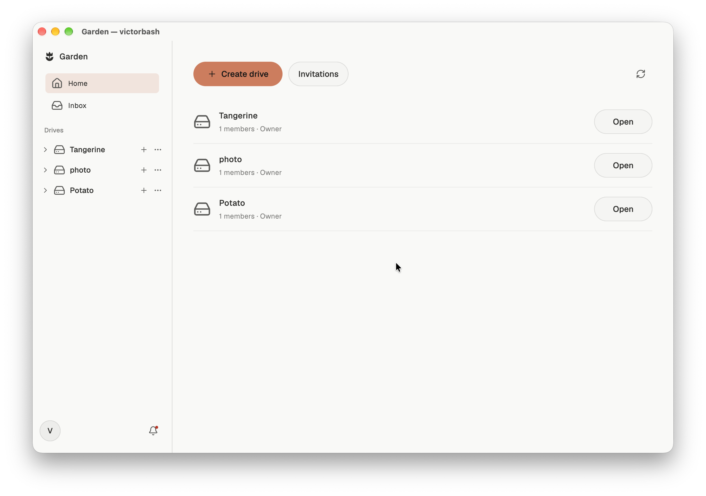
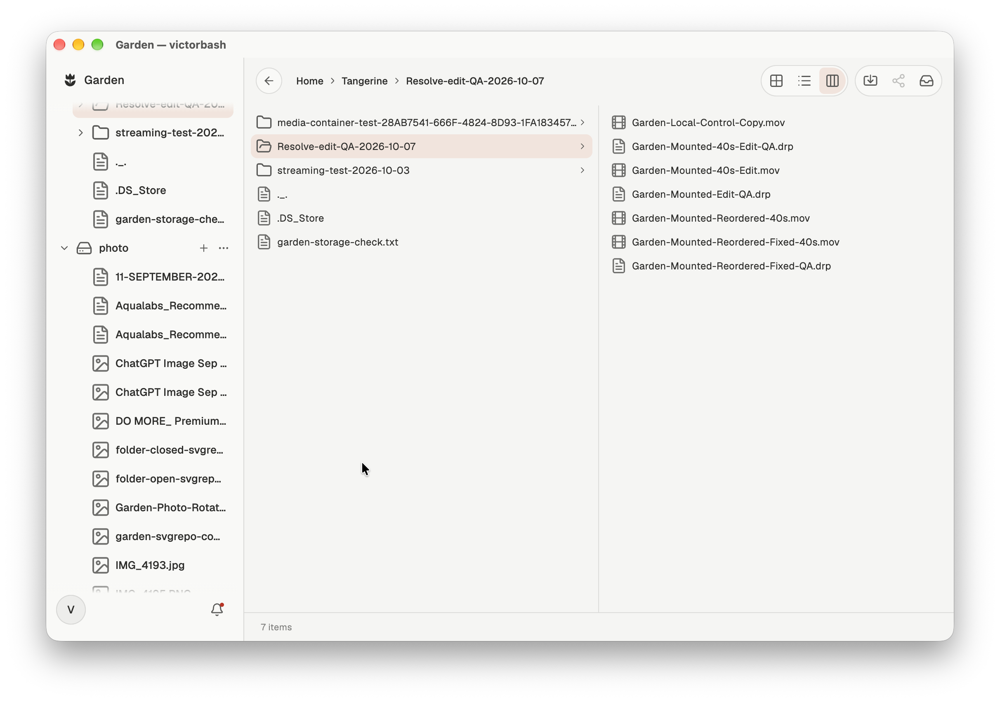

# Garden

## Inspiration and problem

Creators, researchers and teams can work with datasets and file collections larger than the storage available on their computers. Downloading those files before opening them, or synchronizing a full folder locally, consumes disk space and delays access. Using several computers means maintaining more local copies or transferring the data again when you change devices.

Expanding local storage adds cost and hardware to manage. [Rising NAND prices](https://www.sec.gov/Archives/edgar/data/723125/000072312526000015/mu-20260528.htm) also put pressure on storage costs. Cloud storage provides remote capacity, but access through uploads and downloads still leaves users managing local working copies. Teams also need control over who can read and edit the files, and a way to make saved changes available to other members.

Garden is a remote filesystem that mounts cloud storage as a drive on your Mac. You can open, edit and save files directly from your applications, sign in on another Mac to access the same drives, and give collaborators access through their own accounts.

Applications use ordinary file operations against the mounted drive. Garden streams the requested byte ranges, serves previously fetched data from its local cache and publishes saved changes to cloud storage. The cache has a configurable size limit, so accessing a large drive does not require keeping a full local copy. Personal and shared drives use the same filesystem; membership determines which operations each account can perform.

## Users

Garden is for individuals and teams who need to work directly with remote files across applications. Personal drives provide a place to keep and use your files. Shared drives let collaborators access the same files through their own accounts, with separate read, edit and management permissions.

## Solution

Garden is a remote filesystem that mounts cloud storage as a regular drive on your Mac. Create a drive, organize folders, open files in your applications and save back to the same drive. Garden streams requested byte ranges, manages its local cache and publishes file changes to cloud storage.



The mounted filesystem changes how remote files are accessed:

| Step | Upload/download workflow | Garden's mounted workflow |
| --- | --- | --- |
| Open a project | Download files into a local working folder | Open files through the Garden drive path |
| Read large media | Prepare a local copy before editing | Fetch requested byte ranges and reuse a bounded cache |
| Save the result | Save locally, then upload the result | Save to the drive; Garden journals and publishes the write |
| Work with a team | Distribute files and coordinate access separately | Share drive membership, permissions and file-linked conversations |

Garden uses local cache space for fetched ranges and a write journal for accepted edits. Repeated reads can use cached data; uncached reads depend on the network and cloud service. An application that requests every byte can still cause a full-file transfer.

### Editing directly in DaVinci Resolve

The media workflow has been exercised with an MP4 opened from a mounted Garden drive in DaVinci Resolve. The test included linked video and audio cuts, reordering a 40-second timeline, exporting the rendered video and a `.drp` project archive directly to Garden, then reopening the saved project after the drive was safely remounted. The project reopened without a media relink prompt.

The exported video and project archive were checked against independent cloud downloads. The corrected render fully decoded, and its video and audio were compared with a local render of the same timeline. These checks establish a tested editing and saving flow; they do not establish universal codec compatibility or uninterrupted real-time playback.

> **Image to add: Resolve reading Garden media.** Show the decoded source viewer and the clip's actual `/Volumes/Garden-…` path in the Media Pool or file details. Caption: “Source media opened from the mounted Garden drive.”

> **Image to add: Resolve timeline and direct export.** Show the linked video/audio cuts and an export destination inside the Garden drive. Caption: “Edited in Resolve and rendered directly to Garden.”



Shared drives have Owner, Manager, Editor and Viewer roles. Garden's Inbox keeps drive conversations, private conversations, invitations and file references together. Sharing a drive gives a team a common working location; it does not imply simultaneous editing of a single Resolve timeline.

## Technology and architecture

**Flutter provides the application; Serverpod provides the shared system behind it.** The Flutter app handles account setup, drive browsing, uploads, storage controls and collaboration. A Swift helper mounts drives through macFUSE on macOS and translates filesystem operations into authenticated Serverpod requests.

```text
Flutter + generated Dart client       Finder + Swift/macFUSE
                │                              │
                └──────── Serverpod API ────────┘
                                 │
                      ┌──────────┴──────────┐
                      ▼                     ▼
              Serverpod PostgreSQL      Private S3
          metadata, messages, access    file content
```

Serverpod owns the metadata and messaging layer. Its generated database models persist drives, folders, file metadata, versions, memberships, conversations and unread state in PostgreSQL. S3 holds file content, not messages or permissions. Serverpod is responsible for:

- **Identity:** [email verification and authentication](backend/lib/server.dart), with registration emails sent through [Serverpod Cloud](backend/lib/src/auth/garden_email_config.dart).
- **Data and access:** [typed models](backend/lib/src/files/file_node.spy.yaml), metadata persisted through Serverpod's PostgreSQL database layer, [drive membership and roles](backend/lib/src/gardens/drive_permissions.dart), and server-enforced authorization.
- **File lifecycle:** [content endpoints](backend/lib/src/files/content_endpoint.dart), versions, multipart uploads and [private S3 integration](backend/lib/src/files/file_storage.dart).
- **Live collaboration:** [drive journals](backend/lib/src/files/drive_journal.dart) and [Inbox streams](backend/lib/src/inbox/inbox_endpoint.dart), with saved cursors for reconnecting.

The [generated Dart client](client/lib/src/protocol/client.dart) connects Flutter to those endpoints. The native helper uses the same backend through its [API client](frontend/macos/FinderShared/GardenAPI.swift). [Range caching](frontend/macos/FinderShared/GardenRangeCache.swift) bounds local read storage, while a [persistent write journal](frontend/macos/RemoteDrive/Engine/RemoteWriteJournal.swift) preserves accepted edits before cloud publication. Database transactions coordinate file metadata, committed versions and change events.

The backend runs on Serverpod Cloud. The current production file provider is AWS S3; the application keeps metadata and object storage responsibilities separate. This provides a foundation for adding other providers without making each one a separate user workflow.

## Impact

Garden lets users open and save remote files through a mounted drive instead of managing a separate download and upload for each edit. The cache has a configurable disk limit. Shared drives provide access controls, and file-linked conversations let members discuss the files they are working on.

The current preview demonstrates the complete path from email signup to a shared drive, native file access, cloud saves and safe logout. It is available as a [macOS download](https://github.com/victorbash400/garden/releases/tag/v0.1.0-preview.2), with an onboarding checklist and [installation instructions](release/INSTALL.txt). The next steps are broader media testing, more storage providers and access from additional device platforms.
